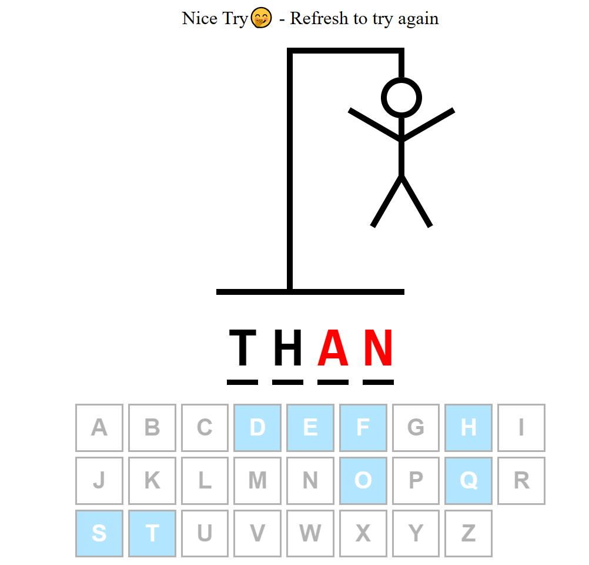
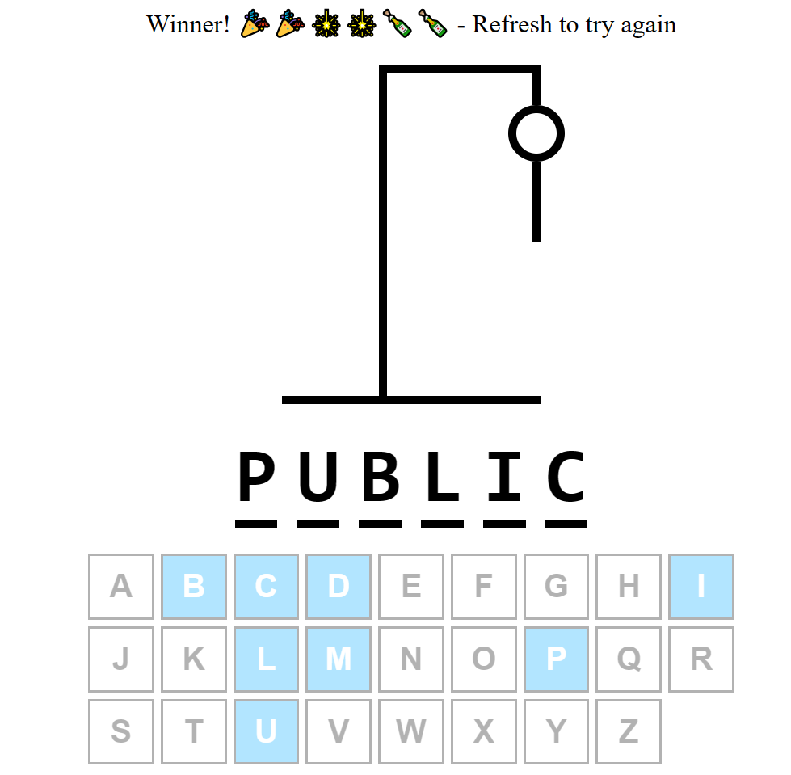

<!-- # React + TypeScript + Vite

This template provides a minimal setup to get React working in Vite with HMR and some ESLint rules.

Currently, two official plugins are available:

- [@vitejs/plugin-react](https://github.com/vitejs/vite-plugin-react/blob/main/packages/plugin-react/README.md) uses [Babel](https://babeljs.io/) for Fast Refresh
- [@vitejs/plugin-react-swc](https://github.com/vitejs/vite-plugin-react-swc) uses [SWC](https://swc.rs/) for Fast Refresh

## Expanding the ESLint configuration

If you are developing a production application, we recommend updating the configuration to enable type aware lint rules:

- Configure the top-level `parserOptions` property like this:

```js
export default {
  // other rules...
  parserOptions: {
    ecmaVersion: 'latest',
    sourceType: 'module',
    project: ['./tsconfig.json', './tsconfig.node.json'],
    tsconfigRootDir: __dirname,
  },
}
```

- Replace `plugin:@typescript-eslint/recommended` to `plugin:@typescript-eslint/recommended-type-checked` or `plugin:@typescript-eslint/strict-type-checked`
- Optionally add `plugin:@typescript-eslint/stylistic-type-checked`
- Install [eslint-plugin-react](https://github.com/jsx-eslint/eslint-plugin-react) and add `plugin:react/recommended` & `plugin:react/jsx-runtime` to the `extends` list -->

# Hangman - React + TS + Vite

## Hangman
Hangman is a classic word guessing game for one or more players. It can be played with pen and paper, online, or even with a friend where one person picks the word and the other tries to guess it.

## How it works

* **Choosing a word:** If you're playing with someone else, they will pick a word (or phrase) to keep secret.
* **The blanks:** You'll then need to draw up some dashes, one for each letter in the hidden word.
* **Guessing letters:** You (or the other player) will then try to guess the letters in the word. You can guess one letter at a time.
* **Correct guesses:** If the letter you guess is in the word, the person keeping track will fill in the blanks wherever that letter appears in the word.
* **Incorrect guesses:** If the letter you guess is not in the word, that's a wrong guess! Depending on the rules you're playing with, you might get a mark (like a part of a hangman) drawn against you.
* **Winning and losing:** The game continues until you either guess the entire word before you run out of guesses (indicated by the completion of the hangman drawing), or you guess all the letters in the word correctly.
## Screenshots



